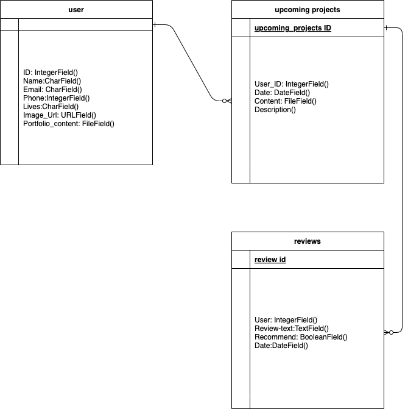
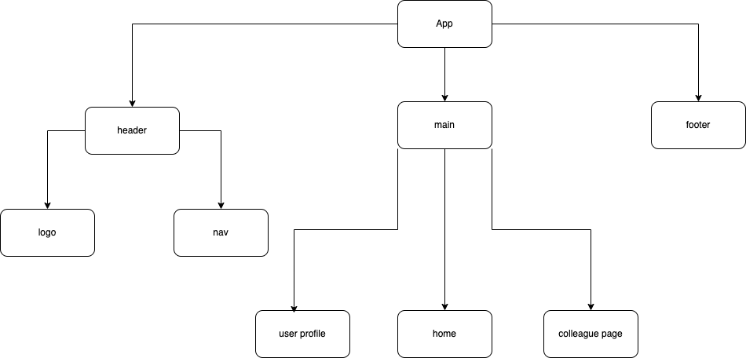
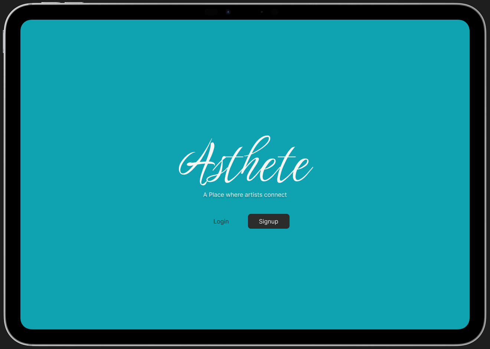

# Aesthete

## A platform for artists to connect.

Azalea Nikitin 

## Description

Here is a social media platform where all artists of differenct expression come together to collaborate on projects and achieve great outcomes to share with the world.

## As a user:
Create an account with a username and password

Login to an existing account with username and password

create a portfolio(include a media uploader to upload files, music, and videos)

fill out a questionare to see if users are compatabile in work ethic.

leave reviews for one another after working on a project together.

## ERD 

## Component Hierarchy

## Wireframes

## Technologies
* HTML/CSS
* JavaScript
* Django
* React
* Python
* Node JS
* Cors
